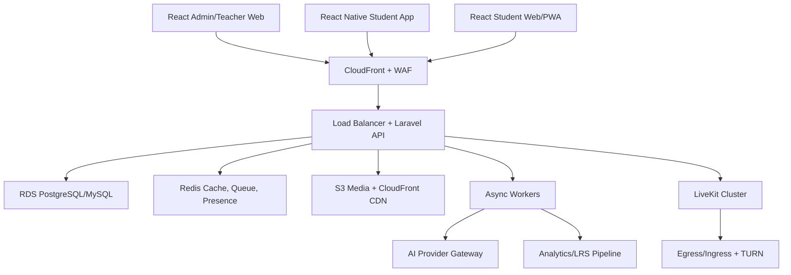

# Modern Scalable LMS — Architecture and Development Plan

**Proposed stack:** PHP/Laravel backend, React + TypeScript web applications, React Native student application, AWS infrastructure, and LiveKit for live classes.

## Confirmed architecture baseline — 9 August 2026

| Decision | Confirmed baseline |
|---|---|
| Product | Multi-tenant SaaS with per-institution name, logo, colours, domain, email templates, certificates, policies, feature flags, and integrations |
| Initial scale | 10,000 registered users, 1,000 daily users, and 500 peak concurrent users |
| Growth objective | Horizontal, cell-based scaling without a fixed application-level ceiling; actual capacity remains governed by tested infrastructure and AWS/service quotas |
| Initial regions | India, European Union, and United States |
| Database | MySQL only, using managed Amazon RDS MySQL |
| Learning standards | SCORM 1.2, SCORM 2004, and Tin Can/xAPI |
| Offline rights | Copyright owned by the platform/content owner; authorized reading only, with encrypted, device-bound, expiring downloads and anti-sharing controls |
| Live learning | Dedicated AWS LiveKit media stack per institution, sized initially for at least 5 simultaneous rooms and up to 25 participants per room, then autoscaled from measured demand |
| AI policy | Maximum practical AI assistance, with every publishable learning artifact and every consequential academic output verified by an authorized teacher |

“Scalable to any extent” is implemented as a no-fixed-ceiling horizontal architecture, not as an infinite-capacity promise. Each release must publish and validate capacity envelopes through load testing, and service quotas must be raised before demand reaches them.

## 1. Product vision

Build a fast, simple, modern learning platform that supports self-paced, instructor-led, live, recorded, standards-based, and offline learning. Students and teachers may self-register, but their access and roles are activated through configurable approval workflows. The system must serve administrators, teachers, and students through role-specific dashboards and scale without requiring a premature microservices architecture.

## 2. User roles and approvals

| Role | Main abilities | Approval model |
|---|---|---|
| Super administrator | Tenants, plans, global settings, security, integrations | Created by system owner |
| Institution administrator | Users, teachers, courses, batches, reports, certificates | Approved by super administrator when multi-tenant |
| Teacher | Author courses, schedule classes, assessments, grading, analytics | Self-registration followed by administrator approval |
| Student | Enrol, learn online/offline, attend classes, submit work, receive certificates | Self-registration followed by configurable auto/manual approval |
| Course reviewer | Review accuracy, copyright, accessibility, and AI-generated content | Assigned by administrator |
| Parent/guardian (optional) | View linked learner attendance and progress | Invitation and consent based |

Approval states should be `pending`, `approved`, `rejected`, `suspended`, and `archived`, with reason, approver, timestamp, notification, and a complete audit trail. Course publication follows a separate `draft → review → approved → published → retired` workflow.

## 3. Functional scope

### Learning delivery

- Structured programs, courses, subjects, modules, lessons, prerequisites, cohorts, batches, and learning paths.
- Text/HTML, PDF, PPT/PPTX, DOC/DOCX, audio, images, hosted video, YouTube video, YouTube Live, external links, downloadable resources, SCORM 1.2/2004, and Tin Can/xAPI packages.
- Responsive browser player and React Native player; captions, transcripts, bookmarks, notes, playback speed, multilingual metadata, and accessibility.
- Offline download of permitted content, encrypted device storage, resumable downloads, local progress/event queue, conflict-safe synchronization, expiry/revocation, and per-device limits.
- Drip release, due dates, prerequisites, sequential/free navigation, completion rules, continuing education credits, badges, and verifiable certificates.

### Live teaching with LiveKit

- Class scheduling, recurring sessions, waiting room, attendance, teacher/co-host controls, screen sharing, chat, reactions, polls, hand raise, whiteboard integration, breakout-room extension point, and moderated Q&A.
- Laravel creates rooms and short-lived participant tokens; clients never receive the LiveKit API secret.
- Signed LiveKit webhooks record join/leave and media events. Heartbeats plus webhook events produce defensible attendance duration.
- Egress records composite/individual tracks to object storage and can export RTMP to YouTube Live. Recordings pass through processing, captioning, moderation/review, and publication states.
- TURN/TLS fallback for restrictive networks; adaptive streaming and simulcast for variable bandwidth.

### Assessments and engagement

- Question banks, categories, difficulty, outcomes, versions, randomization, question/choice shuffling, time limits, negative marking, multiple attempts, pass rules, and accommodations.
- MCQ, multi-select, true/false, fill-in, matching, ordering, numeric, short/long answer, file upload, oral/video response, coding/LTI extension, and rubric-based assignments.
- Quizzes, exams, practice tests, surveys, polls, and session-wise feedback forms.
- Auto-grading where deterministic; teacher moderation for subjective or AI-assisted grading; regrade and appeal workflow.
- Live polls can use LiveKit data messages for immediacy, while the API/database remains the durable source of truth.

### Dashboards

- **Administrator:** approvals, adoption, active users, course health, attendance, completion, assessment quality, infrastructure/job health, storage, moderation, compliance, and exports.
- **Teacher:** assigned courses and cohorts, authoring/review queue, upcoming sessions, attendance, grading queue, at-risk students, question analysis, survey/poll results, and announcements.
- **Student:** continue learning, downloads, calendar, live classes, assignments, quiz results, progress, feedback, certificates, notifications, and support.

### Communication

- In-app and push notifications, email, announcements, course discussion, class chat, calendar reminders, notification preferences, and templated messages.
- Mobile push through Firebase Cloud Messaging/APNs; asynchronous delivery with retries and dead-letter handling.

## 4. Logical architecture

### Multi-region SaaS topology

Use a **global control plane plus regional application cells**:

- Global tenant directory stores minimal routing metadata: tenant identifier, custom domain, home region, status, and branding version.
- CloudFront/Route 53 route the institution to its assigned home-region cell.
- Initial cells should be deployed in an India region, an EU region, and a US region. Exact primary/DR region pairs are selected during compliance and latency validation.
- Each regional cell contains Laravel API/worker services, RDS MySQL, Redis/SQS, tenant-partitioned S3 storage, search/analytics adapters, and observability.
- Tenant personal and learning data stays in the tenant's home region unless an approved contract and transfer policy permits replication.
- A new cell can be added without redesigning the applications. Large institutions can later receive a dedicated application/database cell.
- Branding and tenant configuration are resolved at the edge and cached, while authorization always resolves the canonical tenant on the server.

For the initial user volume, use a shared regional RDS MySQL cluster with `tenant_id` on all tenant-owned tables, composite tenant-first indexes, tenant-aware repositories/policies, cache-key namespacing, per-tenant object prefixes/keys, and automated cross-tenant isolation tests. Because MySQL does not provide PostgreSQL-style row-level security, tenant isolation must be mandatory at the application/data-access layer. Offer database-per-tenant deployment later for regulated or very large institutions.

## 5. Backend design

Use a **Laravel modular monolith** initially. Each module owns its application services, authorization policies, events, jobs, API resources, migrations, and tests. Modules communicate through explicit service contracts and domain events rather than accessing one another's tables indiscriminately.

Recommended modules:

1. Identity, authentication, organizations, roles, permissions, approvals, consent, and audit.
2. Course catalog, curriculum, authoring, versioning, review, enrolment, cohorts, and learning paths.
3. Content/media, uploads, conversions, captions, document previews, video playback, and offline licenses.
4. Learning runtime, attempts, progress, completion, bookmarks, notes, and event ingestion.
5. SCORM runtime and package validation; isolated iframe/player origin and strict content security policy.
6. xAPI client plus Learning Record Store adapter. Adopt an established conformant LRS rather than inventing one inside the core LMS.
7. Live sessions, LiveKit tokens/webhooks, attendance, recordings, YouTube integrations, polls, and session feedback.
8. Assessments, question banks, attempts, grading, rubrics, surveys, and item analysis.
9. Notifications, discussions, certificates, badges, search, reports, exports, and support.
10. AI orchestration, prompt/template versions, provider adapters, policies, usage, costs, citations, review, and evaluation.

Use REST APIs documented with OpenAPI. Version public/mobile APIs under `/api/v1`. Use idempotency keys for submissions and sync, optimistic concurrency for authored content, cursor pagination for event-heavy feeds, and UUID/ULID identifiers where offline creation or distributed ingestion benefits from them.

### Primary data groups

- `users`, `profiles`, `organizations`, `memberships`, `roles`, `permissions`, `approval_requests`, `consents`, `devices`
- `courses`, `course_versions`, `modules`, `lessons`, `content_items`, `content_versions`, `learning_paths`
- `cohorts`, `enrolments`, `progress`, `attempts`, `completion_rules`, `offline_packages`, `sync_events`
- `live_sessions`, `session_participants`, `attendance_events`, `recordings`, `polls`, `poll_responses`, `session_feedback`
- `question_banks`, `questions`, `question_versions`, `assessments`, `assessment_attempts`, `responses`, `rubrics`, `grades`
- `scorm_packages`, `scorm_registrations`, `scorm_runtime_values`, `xapi_statements`
- `notifications`, `discussions`, `certificates`, `audit_logs`, `domain_events`, `ai_jobs`, `ai_artifacts`, `ai_reviews`

Large media and package files belong in S3, not the relational database. Store immutable object keys, checksums, metadata, ownership, processing state, and retention policy in the database.

## 6. AWS deployment architecture

### Recommended production topology

- Route 53, AWS Certificate Manager, CloudFront, and AWS WAF at the edge.
- Static React builds and public assets in private S3 origins behind CloudFront.
- Application Load Balancer serving containerized Laravel API and web runtime on ECS. Start with ECS on EC2 if the requirement is specifically to operate EC2 instances; Fargate is a later operational simplification option.
- Separate ECS services for API, scheduler, general queue workers, document/media workers, AI workers, and WebSocket/realtime gateway if used.
- RDS PostgreSQL (preferred for rich reporting and JSON/event workloads) or MySQL, Multi-AZ in production, automated backups, point-in-time recovery, and read replicas when reporting load requires them.
- ElastiCache Redis replication group for cache, rate limits, sessions (if needed), queue coordination, and ephemeral state.
- S3 with versioning, encryption, lifecycle rules, malware/quarantine flow, and presigned multipart uploads; CloudFront signed URLs/cookies for protected delivery.
- SQS for durable high-volume work and dead-letter queues. Laravel's queue abstraction can start on Redis during development and use SQS in production.
- OpenSearch only when catalog/discovery requirements outgrow database search.
- CloudWatch logs, metrics, alarms, dashboards, distributed tracing, SNS alerts, CloudTrail, GuardDuty, AWS Config, Secrets Manager, and KMS.
- ECR plus GitHub Actions or AWS pipeline tooling for build, test, security scan, migration gate, and rolling/blue-green deployment.
- Infrastructure as code using AWS CDK or Terraform; separate development, staging, and production accounts/environments.

### LiveKit placement

Run LiveKit separately from the Laravel ECS services. For an initial controlled deployment, use dedicated compute-optimized EC2 instances with public IP awareness, security groups for documented TCP/UDP ports, Redis where required, trusted TLS certificates, and a separate TURN hostname. Deploy egress on separate worker instances because recording/transcoding is CPU-intensive. At higher concurrency, move LiveKit components to an autoscaled Kubernetes/EKS design or adopt LiveKit Cloud after a cost/operations comparison.

For the confirmed isolation requirement, provision a **dedicated LiveKit media stack per institution** from one versioned infrastructure template. The shared LMS control plane selects the institution stack, creates a room, and issues short-lived scoped tokens. Every stack receives its own hostname, API credentials, security boundary, metrics, logs, recording prefix, cost tags, and scaling policy. “Minimum 5 rooms” means guaranteed tested capacity for five simultaneous active rooms—not five idle servers or permanently open rooms. Each room is capped at 25 participants by policy. Admission control rejects or queues joins when an institution exceeds its purchased/tested capacity.

This dedicated-per-institution model has higher minimum cost and operational overhead than a shared LiveKit cluster. Automate provisioning, upgrades, certificate rotation, health checks, capacity tests, and teardown. Small tenants may be offered a shared tier later only if the business changes the isolation requirement.

Do not proxy WebRTC media through the ordinary Laravel ALB. The LMS API handles authorization, scheduling, tokens, metadata, and webhooks; LiveKit handles media transport.

### Environments and initial sizing approach

Do not choose production instance sizes from guesswork. Establish targets for concurrent learners, concurrent rooms, participants per room, camera resolution, recording percentage, storage, and geographical distribution. Run API, database, queue, and LiveKit load tests separately and then an end-to-end test. Autoscaling signals should include request latency, error rate, CPU/memory, queue age, active rooms/participants, packet loss, and egress backlog—not CPU alone.

## 7. Offline-first mobile architecture

1. Student enrols and requests a downloadable course or module.
2. API checks authorization, content policy, device limit, and expiry, then returns a signed manifest.
3. React Native downloads checksummed assets with pause/resume into encrypted application storage.
4. Learning interactions are written locally using client-generated event IDs and monotonically ordered timestamps.
5. A background sync sends batches with an idempotency key; the server acknowledges each event individually.
6. Server calculates canonical progress, returns any conflicts or revoked assets, and the device updates its checkpoint.

### Offline copyright protection

- Never expose permanent S3 URLs. Create encrypted per-course packages and short-lived download manifests.
- Wrap each package key for a registered device/user; store keys in Android Keystore or iOS Keychain/Secure Enclave-backed storage where available.
- Enforce licence expiry, maximum registered devices, background revocation checks, logout/key deletion, integrity checks, and remote invalidation.
- Decrypt only while streaming into the application player; do not export plaintext to shared device folders.
- Disable sharing/export, apply OS screenshot/screen-recording protection where supported, detect obviously compromised devices according to policy, and watermark pages/video with user/institution/time identifiers.
- Record download, open, expiry, revocation, and suspicious-device events in the audit system.

These controls reduce copying and sharing but cannot make copying physically impossible: another camera or compromised operating system can capture displayed content. Terms, user education, watermark traceability, and enforcement complement technical controls.

Offline support applies to learning content and eligible assessments, not to live classes. High-stakes examinations should normally require a stable online session unless a separately designed secure offline-exam workflow is approved.

## 8. AI architecture and safeguards

Create an internal **AI Gateway** instead of embedding provider calls throughout controllers. It exposes task-oriented operations and can route to approved hosted or self-hosted models.

Supported workflows:

- Course outline, lesson draft, examples, glossary, summary, learning objectives, translations, accessibility descriptions, slide/storyboard, narration, captions, and metadata.
- Question generation aligned to learning objectives and Bloom-style cognitive levels; distractor generation, duplicate detection, answer/rubric suggestions, and difficulty estimation.
- Transcript and document extraction, semantic search, learner Q&A grounded only in permitted course sources, teacher copilot, and personalized remediation recommendations.
- Survey/feedback theme and sentiment analysis, assessment item analysis, risk indicators, progress narratives, and cohort insights.

Required controls:

- Provider/model allow-list, data-classification policy, tenant isolation, configurable retention, redaction of personal data, prompt-injection defenses, output schema validation, rate/cost limits, and full audit metadata.
- Retrieval-augmented generation with source citations and permission filtering; no cross-course or cross-tenant leakage.
- Human approval before AI-created course content/questions are published and before subjective AI-generated grades affect a student.
- Teachers can see evidence and override recommendations; students can appeal grades and opt out where law/policy requires.
- Evaluate hallucination, bias, language quality, accessibility, question validity, and grading agreement on a versioned test set before enabling a model in production.
- AI indicators are decision support, never the sole basis for punitive or irreversible action.

### Initial AI toolset and LMS usage

Implement the provider-neutral AI Gateway first. Model names are configuration, never hard-coded into course or assessment code. A routing policy selects a low-cost model for bulk work, a stronger model for difficult work, and an alternate provider for evaluation/fallback. Availability, regional processing, data retention, quality, and cost must be approved independently for India, EU, and US tenants.

| Priority | Tool/service | Initial use in the LMS | Release control |
|---|---|---|---|
| 1 | **Amazon Bedrock** | Primary AWS-native model gateway; access approved foundation models, enforce provider routing, quotas, tenant cost allocation, and regional policies | Allow-list models/regions; log prompt template, model, tokens, cost, and reviewer |
| 1 | **OpenAI Responses API — GPT-5.6 Terra** | Default high-quality course outlines, lesson drafts, question/rubric generation, answer explanations, teacher copilot, feedback synthesis, and complex learner remediation | Output remains `AI draft`; teacher approval required |
| 1 | **OpenAI GPT-5.6 Luna** | High-volume, cost-sensitive classification, tagging, metadata, summaries, simple question variations, and first-pass feedback clustering | Schema validation and sampled teacher QA |
| 1 | **OpenAI GPT-5.6 Sol** | Escalation for difficult reasoning, curriculum alignment, assessment-quality review, and complex content transformation—not the default bulk model | Restricted to approved workflows and budget thresholds |
| 1 | **Amazon Bedrock Knowledge Bases or OpenAI File Search** | Permission-filtered RAG over approved course sources for learner tutor, teacher assistant, content search, and citation-backed answers | One tenant/course security boundary; citations mandatory; no answer when evidence is insufficient |
| 1 | **OpenAI Embeddings or an approved Bedrock embedding model** | Semantic course search, duplicate-question detection, related lessons, recommendation candidates, and feedback clustering | Store tenant/course ACL metadata with every vector |
| 1 | **Amazon Textract** | Extract text, tables, and structure from scanned PDFs and documents before review/conversion | Teacher corrects OCR and reading order |
| 1 | **Amazon Transcribe and OpenAI transcription models** | Recorded-class transcripts, captions, searchable timecodes, lecture summaries, attendance-review support, and multilingual transcription evaluation | Human correction workflow; retain original recording/timecodes |
| 1 | **Amazon Polly and OpenAI text-to-speech** | Accessible lesson narration and approved multilingual audio versions | Disclose synthetic voice; pronunciation review; consent for any cloned voice |
| 1 | **Amazon Translate plus LLM review** | First-pass translation/localization of lessons, captions, UI strings, quizzes, and metadata | Qualified teacher/language reviewer approves publication |
| 1 | **OpenAI omni-moderation-latest and Amazon Bedrock Guardrails** | Flag unsafe text/images, prompt attacks, prohibited topics, abusive discussions, and unsafe generated drafts | Flags route to policy/reviewer workflow; no automatic academic punishment |
| 2 | **GPT Image or approved Bedrock image model** | Lesson illustrations, thumbnails, diagrams drafts, scenario images, and accessible visual variations | Copyright/safety/style review; provenance and prompt retained |
| 2 | **Self-hosted F5-TTS** | Institution-controlled narration and consented voice cloning for copyrighted courses, where language quality and hardware capacity are validated | Explicit speaker consent, restricted voice assets, watermark/provenance, teacher audio review |
| 2 | **Self-hosted SadTalker** | Optional talking-presenter video from an authorized portrait and approved narration | Written image/voice rights, visible AI disclosure, teacher review |
| 2 | **Amazon Rekognition** | Optional media labelling and moderation assistance for uploaded images/video | Do not use face recognition or emotion inference for grading/attendance |
| 2 | **Amazon Bedrock Evaluations plus internal golden datasets** | Compare models/prompts for correctness, retrieval, multilingual quality, bias, grading agreement, latency, and cost | Promotion gate before a model/template reaches production |

### First AI workflows to build

1. **Course Import Assistant:** ingest DOCX/PPTX/PDF/transcript → extract structure → propose modules/lessons/objectives → teacher edits and approves.
2. **Assessment Studio:** teacher selects objectives/difficulty/question types → AI creates draft questions, answers, distractors, explanations, and rubric → second-model critique → teacher approval → versioned publication.
3. **Course-grounded Tutor:** retrieve only authorized lesson sources → answer with citations → show “not found in course” when unsupported → escalate to teacher.
4. **Lecture Intelligence:** LiveKit recording → transcription/captions → chapters, summary, glossary, action items, and candidate quiz → teacher review.
5. **Feedback and Progress Analyst:** aggregate survey/free-text feedback and learning events → themes and cohort insights → teacher/admin dashboard; no unsupported individual labels.
6. **Accessibility Assistant:** alt-text drafts, reading-level suggestions, captions, transcript cleanup, audio narration, and document accessibility checks → human verification.
7. **Translation Pipeline:** translate approved source version → terminology/glossary enforcement → bilingual diff → language-teacher approval.

All AI artifacts use a common state machine: `requested → generated → automatically_checked → teacher_review → approved/rejected → published`. Store source version, prompt-template version, model/provider, settings, retrieved citations, safety results, cost, generated artifact, reviewer changes, reviewer identity, and timestamps. Publishing is technically blocked until teacher approval is recorded.

## 9. Security, privacy, and reliability

- Laravel authentication using standards-based OAuth 2.1/OIDC architecture; short-lived access tokens, rotated refresh tokens, MFA for privileged roles, optional institutional SSO, RBAC plus ownership/tenant policies.
- Encrypt in transit and at rest; secrets only in Secrets Manager; least-privilege IAM; private subnets for data services; egress control; WAF and rate limiting.
- Validate file type by content, antivirus scan uploads, quarantine before publication, sanitize converted HTML, and isolate untrusted SCORM/document content.
- Immutable, searchable audit trail for approvals, role changes, grades, course publication, certificates, content/AI actions, and data exports.
- Backups with periodic restore tests; documented RPO/RTO, multi-AZ production resources, health checks, graceful degradation, retry policies, circuit breakers, and dead-letter recovery.
- Privacy center for consent, retention, export, correction, and deletion; meet the institution's applicable Indian and international requirements after legal review.
- Accessibility target WCAG 2.2 AA and keyboard/screen-reader testing across authoring and learning experiences.

## 10. Non-functional targets to validate

These are initial engineering targets, not promises until load-tested:

| Area | Initial target |
|---|---|
| API latency | p95 below 400 ms for ordinary cached/read operations |
| Availability | 99.9% application target after production hardening |
| Web performance | Core student routes usable on mid-range mobile and constrained networks |
| Uploads | Multipart, resumable, checksum-verified, directly to object storage |
| Data loss | Defined RPO ≤ 15 minutes and tested RTO ≤ 4 hours for first production tier |
| Accessibility | WCAG 2.2 AA acceptance criteria |
| Security | Automated SAST/dependency/container scans and annual independent test |
| Offline sync | Idempotent, resumable, per-event acknowledgement and conflict visibility |

## 11. Development roadmap

### Phase 0 — Discovery and foundations (2–3 weeks)

- Confirm institutions/tenancy, expected scale, languages, compliance, assessment rules, media policy, offline rights, and reporting KPIs.
- Produce user journeys, wireframes, domain model, architecture decision records, API conventions, threat model, test strategy, design system, repository structure, and infrastructure baseline.
- Establish CI/CD, environments, observability, secrets, feature flags, coding standards, and seed/demo data.

### Phase 1 — Identity, approvals, and core LMS (5–7 weeks)

- Self-registration, verification, approval workflow, roles/permissions, organizations, profiles, audit, notifications.
- Course catalog, authoring basics, versions, modules/lessons, enrolments/cohorts, progress, completion, dashboards.
- Responsive React admin/teacher/student foundation and initial React Native shell.

**Exit:** an approved teacher publishes a reviewed basic course and an approved student completes it with tracked progress.

### Phase 2 — Content, media, standards, and offline (6–8 weeks)

- S3 uploads/CDN, document preview/conversion, hosted/YouTube media, captions/transcripts.
- SCORM import/player/runtime and xAPI/LRS integration.
- React Native content player, encrypted downloads, offline event store, synchronization and device management.

**Exit:** permitted courses work online and offline; SCORM/xAPI results reconcile into progress and reporting.

### Phase 3 — Assessments and engagement (5–7 weeks)

- Question banks, quizzes/exams/assignments, grading/rubrics, surveys, polls, session feedback, analytics, certificates.
- Teacher grading/moderation workflows and student result/appeal experience.

**Exit:** complete assessment lifecycle with defensible attempt history and useful item/cohort analytics.

### Phase 4 — LiveKit live learning (5–7 weeks)

- Scheduling, token service, web/mobile rooms, attendance, chat/reactions/hand raise, screen share, polls, webhook processing.
- Recording/egress, protected playback, YouTube Live RTMP workflow, TURN/network testing, host/moderation controls.

**Exit:** load-tested live class workflow from schedule through attendance, recording, feedback, and reporting.

### Phase 5 — AI authoring and intelligence (6–9 weeks)

- AI Gateway, provider policies, RAG/source permissions, usage/cost reporting, evaluations, and human review.
- Course/question assistance, learner tutor, transcript/caption support, feedback analysis, and progress/risk insights.

**Exit:** AI features meet quality/privacy evaluations and cannot directly publish or impose consequential grades without authorized review.

### Phase 6 — Scale, security, and production launch (4–6 weeks)

- Performance and WebRTC load tests, accessibility audit, security assessment, restore/DR rehearsal, autoscaling validation, operational runbooks, training, staged migration/pilot, and rollout.

**Indicative total:** 8–11 months for a production-grade first full release with parallel web, mobile, media, LiveKit, QA, DevOps, design, and product work. A useful pilot can be delivered after Phases 1–3. Calendar time depends heavily on team size, content conversion requirements, integrations, and compliance scope.

## 12. Suggested delivery team

- Product owner/domain expert and project manager/scrum lead
- Solution architect/technical lead
- 2–3 Laravel engineers
- 2 React TypeScript engineers
- 2 React Native engineers
- DevOps/SRE engineer with AWS and WebRTC experience
- QA automation engineer plus manual/accessibility QA
- UI/UX designer
- Data/AI engineer added before Phase 5
- Instructional designer/content QA and part-time security/privacy specialist

A smaller team can build it, but scope or calendar duration must change; combining every workstream into one sequential developer creates substantial delivery and operational risk.

## 13. Testing strategy

- Unit, feature/API, authorization/tenant-isolation, contract, migration, and queue/job tests.
- React and React Native component, accessibility, offline/sync, and end-to-end tests.
- SCORM conformance fixtures and xAPI/LRS interoperability suites.
- LiveKit browser/device matrix, NAT/firewall/TURN scenarios, packet-loss tests, recording reliability, and load tests.
- Assessment determinism, grading audit, race/retry/idempotency tests, AI evaluation suites, security scans, penetration test, backup restore, and chaos/failure exercises.

## 14. First implementation backlog

1. Confirm multi-tenancy, registration/approval rules, learner age/consent, languages, and initial concurrency targets.
2. Create architecture decision records for database, authentication/SSO, queue, LRS, LiveKit deployment, mobile offline storage, and AI providers.
3. Establish monorepo or coordinated repositories, Docker development environment, coding rules, CI, staging, infrastructure as code, and observability.
4. Implement identity/organization/approval/audit modules and OpenAPI conventions.
5. Build the shared design system and dashboard shells.
6. Implement versioned course authoring, enrolment, progress events, and basic player.
7. Add notifications and approval/publication workflows.
8. Run the first vertical acceptance test: registration → approval → course publication → enrolment → lesson completion → dashboard reporting.

## 15. Remaining decisions before coding

The product, initial scale, regions, MySQL, standards, offline ownership, dedicated LiveKit topology, and teacher-verified AI policy are now confirmed. The remaining decisions are:

- Tenant pricing/entitlements, custom-domain ownership, institution onboarding, and whether any tenant requires a dedicated application/database cell from launch.
- Exact EU, US, and India primary/DR AWS regions after latency, service/model availability, cost, and legal review.
- Supported languages at launch; minors/guardian consent; data retention/deletion; DPDP, GDPR, FERPA/COPPA applicability and contractual data-transfer rules.
- Preferred conformant LRS and exact SCORM 2004 editions/test packages; proctoring need; grading/appeal and certificate-verification rules.
- Expected institution count at launch, recording percentage/retention, YouTube OAuth/channel ownership, LiveKit SLA, and whether five-room capacity is reserved continuously or available on scheduled warm-up.
- SSO providers, email/SMS/push channels, payment/e-commerce/tax requirements, and external SIS/HRMS/LTI integrations.
- Approved AI providers in each region, tenant opt-in controls, data-retention settings, model budget caps, supported cloned-voice policy, and copyright/provenance policy for generated media.
- MVP launch date, budget band, delivery team, support hours, and final RPO/RTO/SLA.

## 16. Architectural principles

1. Simple user experience; complexity stays behind the interface.
2. Modular monolith first, extract services only from measured need.
3. API-first and event-aware, but relational transactions remain authoritative.
4. Offline and accessibility are core requirements, not final-stage add-ons.
5. Store media in object storage and deliver through a CDN.
6. Separate synchronous requests, asynchronous processing, analytics, AI, and WebRTC workloads.
7. Every consequential action is authorized, auditable, recoverable, and testable.
8. AI assists people; it does not silently replace academic or administrative accountability.
